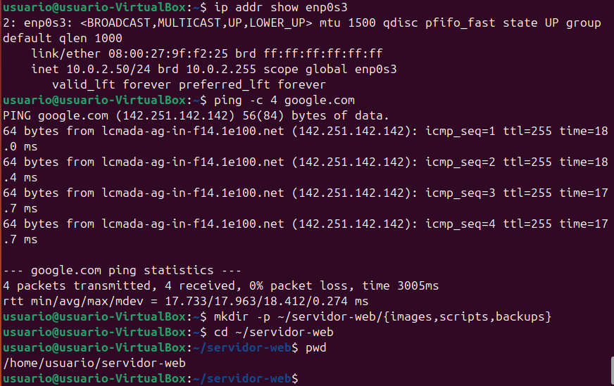
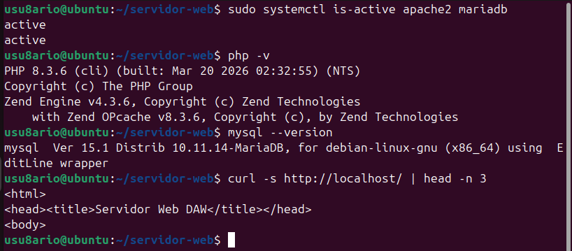
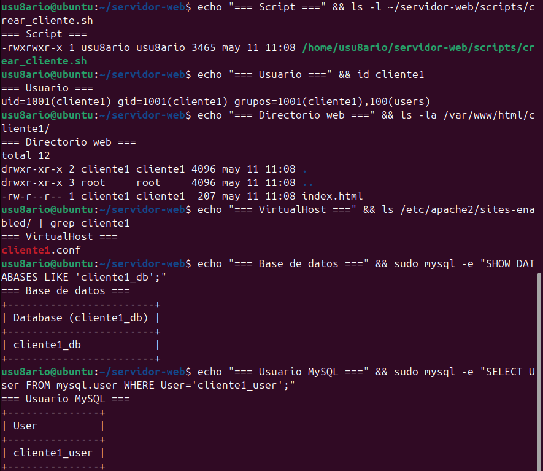
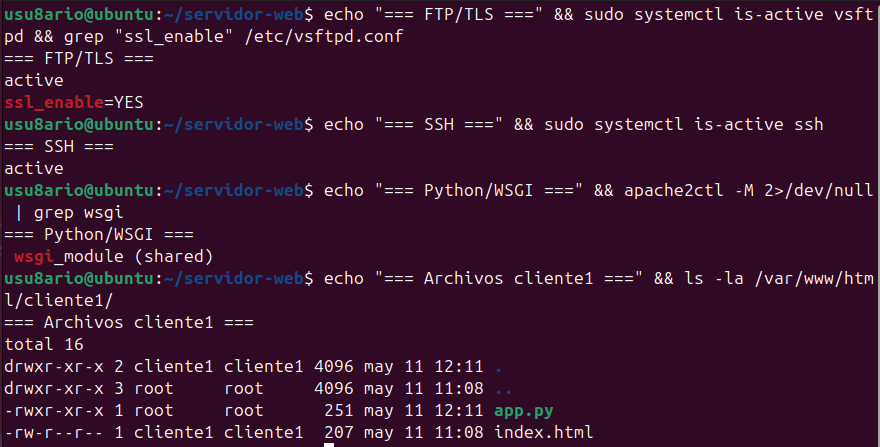
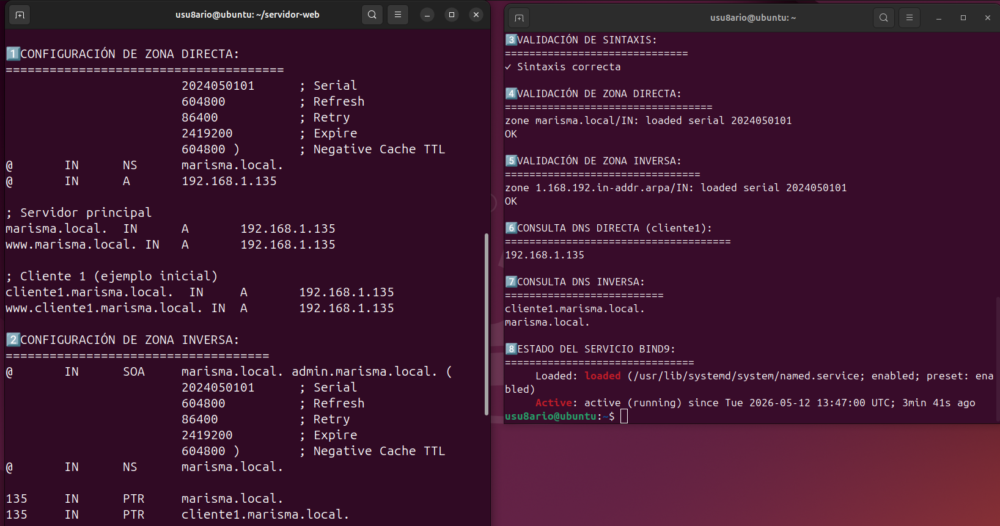
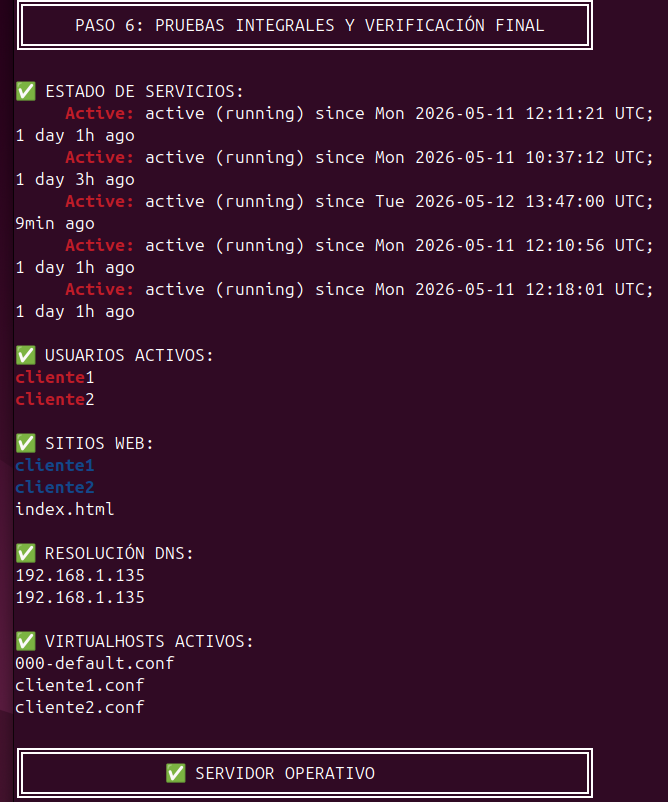

# Práctica 2º Trimestre — Servidor de Alojamiento Web (DAW 2025/26)

**Autor:** Daniel Vázquez Pereira  
**Entorno:** Ubuntu Desktop 24.04 en VirtualBox (Red: Adaptador Puente)  
**IP del Servidor:** 192.168.1.135  
**Dominio Local:** marisma.local  
**Repositorio:** `~/servidor-web/` (estructura: `images/`, `scripts/`, `backups/`)

---

## Índice

1. [Paso 1: Configuración inicial del sistema](#paso-1-configuración-inicial-del-sistema)
2. [Paso 2: Instalación de Apache2, PHP y MariaDB + phpMyAdmin](#paso-2-instalación-de-apache2-php-y-mariadb--phpmyadmin)
3. [Paso 3: Script de automatización de clientes](#paso-3-script-de-automatización-de-clientes)
4. [Paso 4: FTP con TLS + SSH/SFTP + Python con Apache](#paso-4-ftp-con-tls--sshsftp--python-con-apache)
5. [Paso 5: Configuración de DNS con BIND9](#paso-5-configuración-de-dns-con-bind9)
6. [Paso 6: Pruebas integrales y verificación final](#paso-6-pruebas-integrales-y-verificación-final)
7. [Cómo usar el servidor](#cómo-usar-el-servidor)
8. [Arquitectura y componentes](#arquitectura-y-componentes)

---

## Paso 1: Configuración inicial del sistema

**Descripción:**  
Actualización del sistema, instalación de herramientas base de red y gestión, configuración de IP estática/dinámica y creación de la estructura de directorios del proyecto.

**Comandos ejecutados:**
```bash
sudo apt update && sudo apt upgrade -y
sudo apt install -y net-tools vim curl wget git
ip addr show
ping -c 4 google.com
mkdir -p ~/servidor-web/{images,scripts,backups}
cd ~/servidor-web
```

**Resultado:**  
- Sistema completamente actualizado y sin errores de dependencias.
- Conectividad externa verificada.
- Estructura de proyecto creada en `~/servidor-web/`.



---

## Paso 2: Instalación de Apache2, PHP y MariaDB + phpMyAdmin

**Descripción:**  
Despliegue del stack LAMP y la herramienta de administración web de bases de datos. Se habilitaron los módulos de Apache necesarios y se verificó el correcto funcionamiento de cada servicio.

**Comandos ejecutados:**
```bash
sudo apt update
sudo apt install -y apache2 php php-cli php-mysql php-curl php-gd php-mbstring php-xml php-zip libapache2-mod-php mariadb-server mariadb-client phpmyadmin
sudo systemctl enable apache2 mariadb
sudo systemctl start apache2 mariadb
sudo a2enmod rewrite ssl
sudo systemctl restart apache2
sudo ln -sf /etc/phpmyadmin/apache.conf /etc/apache2/conf-available/phpmyadmin.conf
sudo a2enconf phpmyadmin
sudo systemctl reload apache2
```

**Resultado:**  
- Apache2 sirviendo en puerto 80.
- PHP 8.3 operativo con módulos esenciales.
- MariaDB activo y accesible.
- phpMyAdmin disponible en `/phpmyadmin`.



---

## Paso 3: Script de automatización de clientes

**Descripción:**  
Creación del script `crear_cliente.sh` que automatiza en un único comando: usuario del sistema, directorio web, VirtualHost Apache, entrada DNS BIND9 y base de datos MySQL con privilegios completos.

**Comando de instalación:**
```bash
nano ~/servidor-web/scripts/crear_cliente.sh
chmod +x ~/servidor-web/scripts/crear_cliente.sh

# Ejecución de prueba
sudo ~/servidor-web/scripts/crear_cliente.sh cliente1 192.168.1.135

# Verificación
id cliente1
ls -la /var/www/html/cliente1/
ls /etc/apache2/sites-enabled/ | grep cliente1
sudo mysql -e "SHOW DATABASES LIKE 'cliente1_db';"
sudo mysql -e "SELECT User FROM mysql.user WHERE User='cliente1_user';"
```

**Resultado:**  
- Script funcional que crea en un paso: usuario, web, vhost, DNS y base de datos.
- Cliente `cliente1` con directorio `/var/www/html/cliente1/` e `index.html`.
- Base de datos `cliente1_db` con usuario `cliente1_user` y contraseña segura generada.
- VirtualHost habilitado (resolución DNS completa en paso siguiente).



---

## Paso 4: FTP con TLS + SSH/SFTP + Python con Apache

**Descripción:**  
Configuración de vsftpd con cifrado TLS para transferencia segura, habilitación de acceso SSH/SFTP nativo, y ejecución de aplicaciones Python mediante `mod_wsgi` en Apache.

**Comandos ejecutados:**
```bash
sudo apt install -y vsftpd libapache2-mod-wsgi-py3 openssh-server
# /etc/vsftpd.conf: ssl_enable=YES, chroot_local_user=YES, pasv_address=192.168.1.135
sudo systemctl enable vsftpd ssh && sudo systemctl restart vsftpd ssh
sudo ufw allow 21/tcp && sudo ufw allow 40000:40100/tcp
sudo a2enmod wsgi
# Creación de app.py y configuración WSGIScriptAlias en VirtualHost de cliente1
sudo systemctl reload apache2
```

**Resultado:**  
- vsftpd activo con TLS 1.2+, usuarios confinados a su home (`chroot_local_user=YES`).
- SSH/SFTP operativo para administración remota segura.
- Python 3 ejecutándose en Apache vía `mod_wsgi` en ruta `/app`.



---

## Paso 5: Configuración de DNS con BIND9

**Descripción:**  
Instalación y configuración de BIND9 como servidor DNS autoritario local. Se crean zonas directa (`marisma.local`) e inversa (`1.168.192.in-addr.arpa`) con resolución A y PTR. El script `crear_cliente.sh` se actualiza para inyectar automáticamente registros DNS al crear nuevos clientes.

**Comandos ejecutados:**

```bash
sudo apt update
sudo apt install -y bind9 bind9-utils bind9-doc dnsutils
sudo systemctl enable named
sudo systemctl start named
```

**Configuración de zonas en `/etc/bind/named.conf.local`:**
- Zona directa: `marisma.local` — Resuelve nombres a IPs (registros A)
- Zona inversa: `1.168.192.in-addr.arpa` — Resuelve IPs a nombres (registros PTR)

**Archivos de zona:**
- `/etc/bind/db.marisma.local` — Registros SOA, NS, A para servidor y cliente1
- `/etc/bind/db.192` — Registros SOA, NS, PTR para resolución inversa

**Validación de configuración:**

```bash
sudo named-checkconf
sudo named-checkzone marisma.local /etc/bind/db.marisma.local
sudo named-checkzone 1.168.192.in-addr.arpa /etc/bind/db.192
```

**Verificación con `dig`:**

```bash
# Resolución directa - servidor
dig @192.168.1.135 marisma.local

# Resolución directa - cliente1
dig @192.168.1.135 cliente1.marisma.local

# Resolución inversa
dig @192.168.1.135 -x 192.168.1.135
```

**Integración en script `crear_cliente.sh`:**  
El script inyecta automáticamente registros A y PTR en las zonas BIND9 al crear un nuevo cliente, incrementando el serial de zona y recargando el servicio.

**Resultado:**  
- BIND9 operativo como servidor DNS autoritario local.
- Resolución directa (`cliente1.marisma.local` → `192.168.1.135`) verificada.
- Resolución inversa (`192.168.1.135` → `cliente1.marisma.local`) verificada.
- Inyección automática de registros DNS en nuevos clientes.



---

## Paso 6: Pruebas integrales y verificación final

**Descripción:**  
Ejecución de suite completa de pruebas para verificar el funcionamiento integrado de todos los servicios: Apache2, PHP, MariaDB, BIND9, vsftpd, SSH y mod_wsgi. Se valida la creación de clientes, resolución DNS, acceso web y bases de datos.

**Suite de pruebas:**

### A. Verificación de servicios

```bash
sudo systemctl status apache2 mariadb named vsftpd ssh
```

### B. Verificación de usuarios y directorios

```bash
cut -d: -f1 /etc/passwd | grep -E "^cliente|^usuario"
ls -la /var/www/html/
cat /var/www/html/cliente1/index.html
```

### C. Verificación de bases de datos

```bash
sudo mysql -e "SHOW DATABASES;"
sudo mysql -e "SELECT User, Host FROM mysql.user WHERE User LIKE 'cliente%';"
sudo mysql -e "SHOW GRANTS FOR 'cliente1_user'@'localhost';"
```

### D. Verificación DNS

```bash
sudo named-checkconf
sudo named-checkzone marisma.local /etc/bind/db.marisma.local
sudo named-checkzone 1.168.192.in-addr.arpa /etc/bind/db.192
dig @192.168.1.135 cliente1.marisma.local +short
dig @192.168.1.135 -x 192.168.1.135 +short
```

### E. Verificación Apache y VirtualHosts

```bash
ls /etc/apache2/sites-enabled/
curl -s http://192.168.1.135 -I | head -5
curl -s -o /dev/null -w "Status: %{http_code}\n" http://192.168.1.135/phpmyadmin
```

### F. Verificación FTP/SFTP/SSH

```bash
sudo netstat -tlnp | grep -E "21|22"
sudo grep -E "ssl_enable|chroot_local_user" /etc/vsftpd.conf
```

### G. Verificación Python/WSGI

```bash
sudo apache2ctl -M | grep wsgi
ls -la /var/www/html/cliente1/
```

### H. Prueba integral — Crear nuevo cliente

```bash
sudo ~/servidor-web/scripts/crear_cliente.sh cliente2 192.168.1.135
id cliente2
ls -la /var/www/html/cliente2/
sudo mysql -e "SHOW DATABASES LIKE 'cliente2_db';"
dig @192.168.1.135 cliente2.marisma.local +short
curl -s http://cliente2.marisma.local -H "Host: cliente2.marisma.local" | head -5
```

**Resultado:**  
- Todos los servicios operativos: Apache2, MariaDB, BIND9, vsftpd, SSH
- Usuarios creados: `cliente1`, `cliente2`
- Directorios web con contenido por defecto en `/var/www/html/cliente{1,2}/`
- Bases de datos independientes por cliente con usuarios con ALL PRIVILEGES
- Resolución DNS directa e inversa funcional para todos los subdominios
- VirtualHosts habilitados y accesibles vía HTTP
- phpMyAdmin operativo en `/phpmyadmin`
- FTP/SFTP con TLS y SSH accesibles en puertos 21 y 22
- Python ejecutándose en Apache2 vía mod_wsgi
- Script `crear_cliente.sh` completamente funcional



---

## Cómo usar el servidor

### Crear un nuevo cliente

```bash
sudo ~/servidor-web/scripts/crear_cliente.sh nombre_cliente 192.168.1.135
```

El script realiza automáticamente:
- Crea usuario del sistema
- Crea directorio web `/var/www/html/nombre_cliente/`
- Crea página de bienvenida con `index.html`
- Crea VirtualHost Apache con `ServerName nombre_cliente.marisma.local`
- Inyecta registros DNS (A y PTR) en BIND9 con validación automática
- Incrementa serial de zona DNS
- Crea base de datos MySQL `nombre_cliente_db`
- Crea usuario MySQL `nombre_cliente_user` con ALL PRIVILEGES
- Genera contraseña segura con `openssl rand -base64 12`
- Recarga Apache2 y BIND9 automáticamente

**Ejemplos de uso:**
```bash
sudo ~/servidor-web/scripts/crear_cliente.sh tienda 192.168.1.135
sudo ~/servidor-web/scripts/crear_cliente.sh blog 192.168.1.135
sudo ~/servidor-web/scripts/crear_cliente.sh api 192.168.1.135
```

---

## Acceder a los clientes

### Acceso web
```
http://192.168.1.135
http://nombre_cliente.marisma.local
```

### phpMyAdmin
```
URL:       http://192.168.1.135/phpmyadmin
Usuario:   nombre_cliente_user
Contraseña: (generada por el script al crear el cliente)
```

### FTP seguro (TLS)
```bash
ftp nombre_cliente@192.168.1.135
# Puerto 21 — TLS habilitado (FTPS)
```

### SSH / SFTP
```bash
ssh  nombre_cliente@192.168.1.135
sftp nombre_cliente@192.168.1.135
```

---

## Verificar DNS

```bash
# Resolución directa
dig @192.168.1.135 nombre_cliente.marisma.local

# Resolución inversa
dig @192.168.1.135 -x 192.168.1.135

# Todos los registros de la zona
dig @192.168.1.135 marisma.local AXFR
```

---

## Arquitectura y componentes

### Stack tecnológico

| Componente | Versión | Puerto | Estado |
|------------|---------|--------|--------|
| Apache2 | 2.4.x | 80, 443 | Activo |
| PHP | 8.3 | — | Activo |
| MariaDB | 10.11.x | 3306 | Activo |
| BIND9 DNS | 9.18.x | 53 | Activo |
| vsftpd FTP | 3.0.x | 21 | Activo (TLS) |
| OpenSSH | 8.9.x | 22 | Activo |
| mod_wsgi | 4.9.x | — | Activo |

### Archivos de configuración principales

```
/etc/apache2/sites-available/      — VirtualHosts por cliente
/etc/apache2/mods-enabled/         — Módulos habilitados
/etc/bind/named.conf.local         — Definición de zonas
/etc/bind/db.marisma.local         — Zona directa
/etc/bind/db.192                   — Zona inversa
/etc/vsftpd.conf                   — Configuración vsftpd con TLS
/etc/ssh/sshd_config               — Configuración OpenSSH
/etc/mysql/mariadb.conf.d/         — Configuración MariaDB
/etc/php/8.3/apache2/php.ini       — Configuración PHP
```

### Estructura del proyecto

```
~/servidor-web/
├── images/
│   ├── paso1.png
│   ├── paso2.png
│   ├── paso3.png
│   ├── paso4.png
│   ├── paso5.png
│   └── paso6.png
└── scripts/
    └── crear_cliente.sh
```

---

## Seguridad implementada

- FTP con TLS 1.2+: cifrado de credenciales y datos en tránsito
- SSH con OpenSSH: acceso remoto seguro
- Usuarios independientes: cada cliente con usuario del sistema separado
- Chroot FTP: usuarios confinados a su directorio home (`chroot_local_user=YES`)
- Permisos restrictivos: directorios 755, archivos 644
- Bases de datos independientes: BD y usuario MySQL separados por cliente
- Contraseñas aleatorias generadas con openssl (12 caracteres, base64)
- Validación DNS con `named-checkzone` antes de recargar BIND9
- Módulos SSL habilitados en Apache2

---

## Información del entorno

- **Sistema operativo:** Ubuntu 24.04 LTS Desktop
- **Arquitectura:** x86_64
- **Hipervisor:** VirtualBox con Adaptador Puente (Bridged)
- **IP servidor:** 192.168.1.135
- **Dominio local:** marisma.local
- **Zona inversa:** 1.168.192.in-addr.arpa

---

## Autores y contribuciones

**Desarrollo y configuración:** Daniel Vázquez Pereira  
**Centro educativo:** IES La Marisma  
**Comunidad autónoma:** Andalucía (Consejería de Educación y Deporte)

---

**Última actualización:** Mayo 2026  
**Estado:** Completado y operativo  
**Versión:** 1.0
